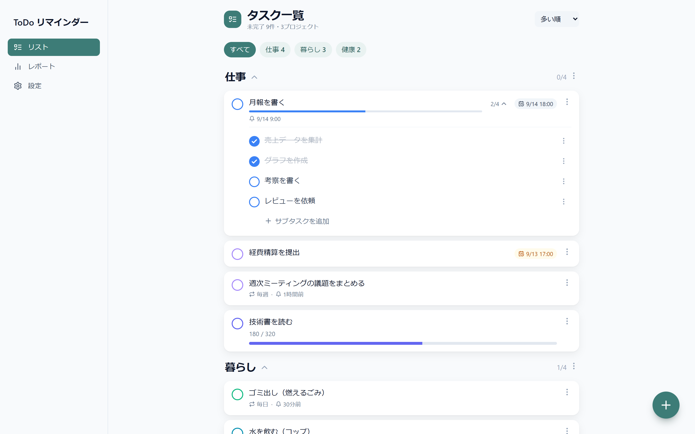
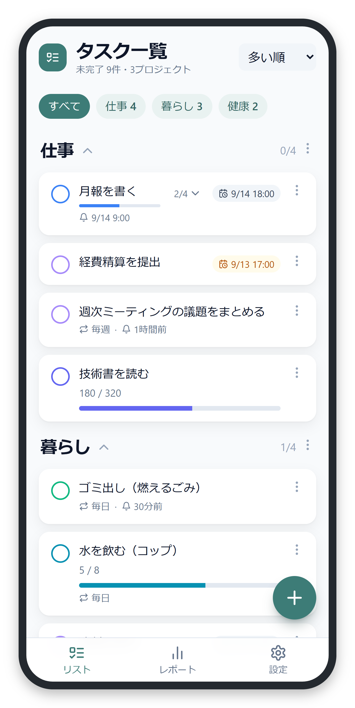
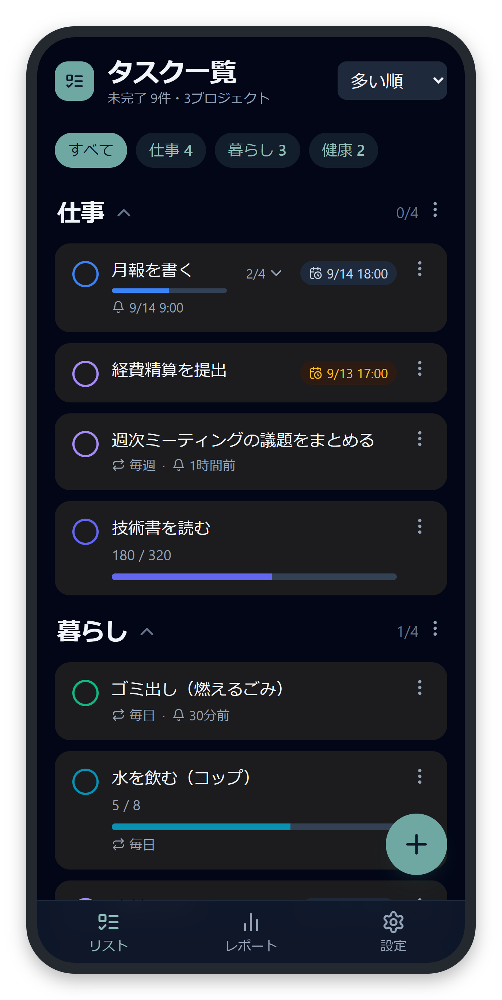
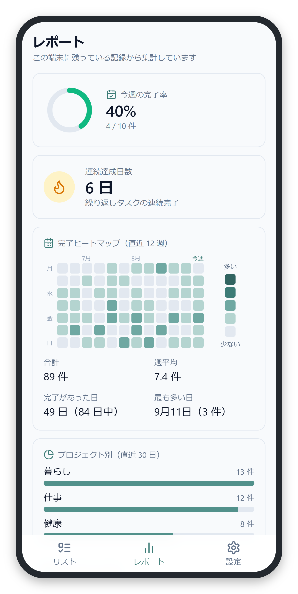

# ToDo リマインダー

**オフラインでも使える、個人・少人数向けの ToDo とリマインダー。** 
タスクは端末に保存され、同期を設定した端末どうしで共有できます。

<a href="https://todo-reminder.pages.dev/"><strong>アプリを開く →</strong></a>

 

  

PC / スマートフォン（ライト・ダーク）/ レポート画面。表示中のタスクはすべて架空のサンプルです。

 

## できること

| | |
|---|---|
| **オフラインで完結** | タスクの作成・完了・整理は、電波が無くてもそのまま動きます。 |
| **期限と繰り返し** | 期限つきのタスク、毎日・毎週・毎月の繰り返し、指定した時刻や区切りの前に鳴るリマインダー。 |
| **定量タスクとサブタスク** | 「320 ページ読む」のような数値目標と、手順を分けて進めるチェックリスト。 |
| **プロジェクトで整理** | タスクをプロジェクトごとにまとめ、絞り込みと並べ替え、ドラッグでの手動並べ替え。 |
| **メモ** | 電話番号やメールアドレスなどを、ワンタップでコピーできる控え。 |
| **複数端末で同期** | 同期コードを共有した端末どうしで、タスクとメモを同期。 |
| **通知** | Web Push 通知と、起動中の端末でのローカル通知。 |
| **レポート** | 週間達成率、連続達成日数、完了ヒートマップ、プロジェクト別の内訳。 |
| **見た目の調整** | ダークモード、文字サイズ変更、ホーム画面に追加して使える PWA。 |

## 利用上の注意

> このアプリは不特定多数向けのサービスではなく、無保証です。重要な予定や、他者に見られて困る内容だけを唯一の記録として置かないでください。

| 項目 | 内容 |
|---|---|
| 端末内の保存 | タスクと表示設定はブラウザの端末内ストレージに保存されます。ブラウザデータを消去すると失われることがあります。 |
| 同期を使う場合 | タスク本文、状態、期限、リマインダー、繰り返し設定、進捗、並び順、**メモの内容**などの同期に必要な情報がサーバーへ送られます。Push を有効にすると、購読先 URL と通知に必要な購読情報も保存されます。 |
| メモに入れる内容 | メモの値は端末にもサーバーにも**暗号化せずそのまま**保存されます。伏せ字表示は覗き見を防ぐための表示上の配慮で、保存や通信を保護するものではありません。**銀行・決済・本人確認など、漏れたときの被害が大きい認証情報は入れないでください。** パスワード管理の専用ツールの代わりにはなりません。 |
| 同期コード | 同期コードは実質的なアクセス情報です。知っている人は、そのコードに紐づくデータへアクセスできる可能性があります。共有・公開・スクリーンショットへの写り込みを避けてください。 |
| 通知 | Push 通知ではタスク名がブラウザや OS の Push サービスを経由します。 |
| 削除と保持 | 削除済み、または非繰り返しで完了したタスクは、実装上は一定期間後にサーバーから削除されます。即時のサーバー全削除機能はありません。 |

## 技術的な概要

| 層 | 構成 |
|---|---|
| フロントエンド | React 18 / Vite 5 / Tailwind CSS / PWA（vite-plugin-pwa） |
| 端末内ストレージ | IndexedDB（Dexie） |
| バックエンド | Cloudflare Workers / D1 / Pages、Web Push、Cron Triggers |

設計、開発、運用、データの扱いの詳細は [docs/README.md](./docs/README.md) を参照してください。

## ライセンス

本リポジトリのソースコードは **All Rights Reserved** です。詳細は [LICENSE](./LICENSE) を参照してください。配信物に含まれるサードパーティの著作権表示とライセンスは [THIRD-PARTY-NOTICES.md](./THIRD-PARTY-NOTICES.md) にあります。
